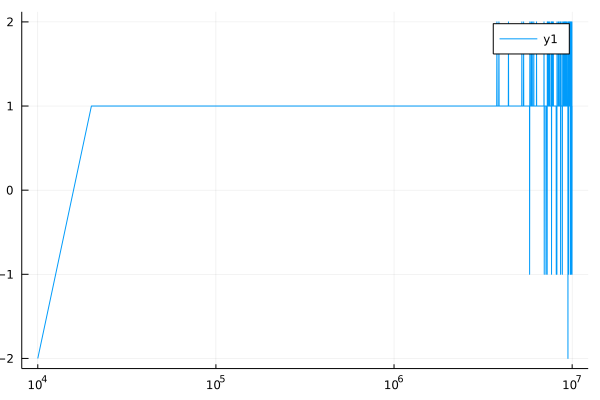

#### NFSP Kuhn

Use `Julia` to implement `Neural Fictitious Self-play(NFSP)` algorithm and test it on `kuhn poker` game(use Env `KuhnPokerEnv`).

* rl_agent: 
```julia
Agent(
    policy = QBasedPolicy(
        learner = DQNLearner,
        explorer = EpsilonGreedyExplorer,
    ),
    trajectory = CircularArraySARTTrajectory
)
```

* sl_agent:
```julia
Agent(
    policy = QBasedPolicy(
        learner = AverageLearner,
        explorer = GreedyExplorer,
    ),
    trajectory = CircularArraySARTTrajectory,
)
```

where `AverageLearner` is an AbstractLearner which I imitated the structure from `DQNLearner` and the loss function is `logitcrossentropy`.

##### recent progress

parameters setting:

most parameters are the same as the [paper](https://arxiv.org/abs/2103.00187)'s `NFSP_Kuhn experiment part`.

<details>
    <summary> same parameters </summary>
    
      
      * anticipatory_param = 0.1,
      * eval_every = 10_000,
      * learn_freq = 128,
      * batch_size = 128,
      * hidden_layers_sizes = (128, 128, 128, 128),
      * min_buffer_size_to_learn = 1_000,
      * optimizer = Descent,


      * SL_buffer_capacity = 2_000_000,
      * SL_learning_rate = 0.01,


      * RL_buffer_capacity = 200_000,
      * update_target_network_every = 19200,
      * discount_factor = 1.0,
      * RL_learning_rate = 0.01,
      * $\epsilon$ _ init = 0.06,
      * $\epsilon$ _ end = 0.001,
      * $\epsilon$ _ decay kind = linear.


</details>

* $\epsilon$ _ decay = 2_000_000,
* train_episodes = 10_000_000, 

* evaluation_metric:

    * get player 1 reward based on the trained policy


