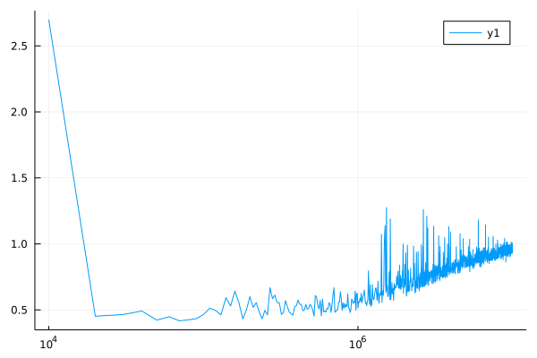

#### NFSP Kuhn

Use `Julia` to implement `Neural Fictitious Self-play(NFSP)` algorithm and test it on `kuhn poker` game(use Env `KuhnPokerEnv`).

* rl_agent: 
```julia
Agent(
    policy = QBasedPolicy(
        learner = DQNLearner,
        explorer = EpsilonGreedyExplorer,
    ),
    trajectory = CircularArraySARTTrajectory
)
```

* sl_agent:
```julia
Agent(
    policy = QBasedPolicy(
        learner = AverageLearner
        explorer = GreedyExplorer,
    ),
    trajectory = CircularArraySARTTrajectory,
)
```

where `AverageLearner` is an AbstractLearner which I imitated the structure from `DQNLearner` and the loss function is `logitcrossentropy`.

##### recent progress

set:

* $\epsilon$ _ decay = 2_000_000,
* train_episodes = 10_000_000,
* eval_every = 10_000,
* $\epsilon$ _ decay kind = linear.

get player 1 reward based on the trained policy


